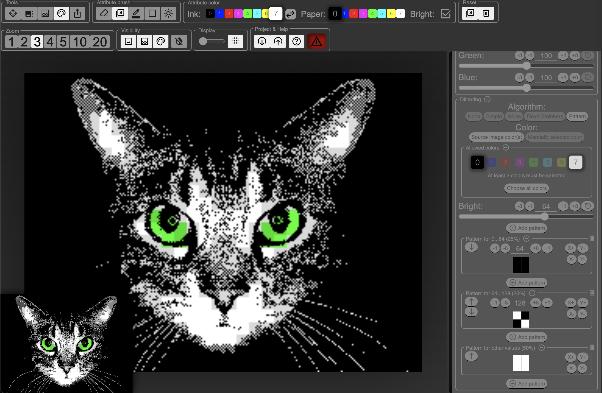

# ZX Spectrum Image Composer

## What is it?
ZX Spectrum Image Composer is a one page web application that allows the user to:
1. Upload image and convert it to ZX Spectrum format
2. Mask parts of the image, so only specific area is visible
3. Manually edit ZX Spectrum pixels
4. Manually edit ZX Spectrum attributes
5. Export full or part of the image in various formats

The application can be used in https://zxspectrumimagecomposer.solvalou.com/

## Technical info

### Structure

The app is a react/redux app using only a few dependencies (react, redux, tooltip, material symbols). There is no backend at all, the whole app is just a bunch of static files and couple of decorative images.

The app stores its state in couple of redux slices, but due to large amount of data (=multiple large images with related metadata in various image layers), some of the data is stored as window attributes (by `windowProperyMiddleware`) for performance reasons. The data is also presisted to window.localStorage (by `localStorageMiddleware`) so reloading the page does not destroy the state.

### Building the app

Clone the repo, install dependencies with `npm install` and start a development server with `npm run dev`. Now when you edit the files, the app in your browser updates automatically.

To make a production build, do `npm run build`.

Deployment scripts (for my personal use, you probably don't have any use for them) are in deployment. You can ignore them as well as the `npm run redeploy` script.
